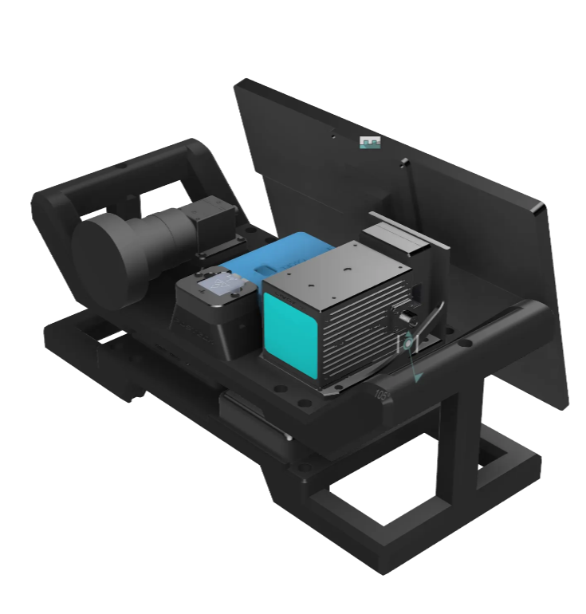
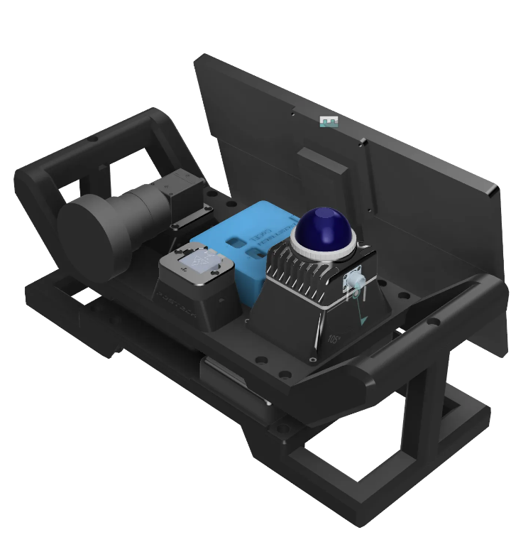

# CoCEL_Handheld_Driver
Handheld device software pack. [CoCEL @POSTECH](https://cocel.postech.ac.kr/)  

[(Click this link!) FAST-LIO2 Real world Test with CoCEL Handheld](https://www.youtube.com/watch?v=Me2jOfhErLY)

**Other Software**
- [CoCEL Handheld Data Recorder](https://github.com/SanghyunPark01/CoCEL_Handheld_DataRecorder)

## Hard ware  
- [LiDAR: AVIA](https://www.livoxtech.com/mid-70)
- [Camera: FLIR Machine vision camera](https://www.flir.com/products/blackfly-s-usb3/?vertical=machine%20vision&segment=iis)
- [IMU: VectorNav vn-100](https://www.vectornav.com/products/detail/vn-100?gad_source=1&gclid=EAIaIQobChMI4aLAoZr5iAMVOPRMAh1-ggUREAAYASABEgLI-_D_BwE)

### Design
**Left** is AVIA version, **Right** is MID360 Version.  
Designed by [JunuHong](https://github.com/JunuHong)
<p align="center">
    
    
</p>


## Software  
**LiDAR**
- Livox LiDAR SDK
- Livox ROS Driver  

**Camera**
- FLIR Camera ROS Driver  

**Frame Synchronization**
- Feedback Sensor Time handler
- STM32 Triggering

<!-- **!! Must Read !!**  
If you want synchronize LiDAR and Camera, you must use `livox_sdk`, `livox_ros_driver`, `flir_camera_driver` in this repository instead of original sdk and driver.   -->

**Download this repository**  
```bash
git clone https://github.com/SanghyunPark01/CoCEL_Handheld_Driver.git
```

### Camera
**Hardware Setup(If you want synchronization)**  
1. Prepare red and black Cable in FLIR Camera Sync Cable.  
2. Connect STM Board GPIO Pin with red cable in FLIR Camera Sync Cable.  
3. Connect STM Board Ground Pin with black cable in FLIR Camera Sync Cable.
<!-- 2. Connect STM Board Timer Pin(Set to 50Hz) with red cable in FLIR Camera Sync Cable.  
3. Connect STM Board Ground Pin with black cable in FLIR Camera Sync Cable.   -->

**Download SDK**  
Download [Spinnaker SDK](https://www.flirkorea.com/products/spinnaker-sdk/) first.  

**Build ROS Package**  
!!!First, Move `flir_camera_driver`(in this repo) **to your ros workspace**.!!!
```bash
$ cd (your ros_workspace)
$ catkin_make
$ source (your ros_workspace)/devel/setup.bash
```  
**Run(Normal)**  
```
$ roslaunch spinnaker_camera_driver camera.launch
```

**Run(Synchronization)**  
```
$ roslaunch spinnaker_camera_driver camera_trigger.launch
```

### LiDAR
<!-- **Hardware Setup**  
1. Prepare blue and black Cable in Livox Sync Cable.  
2. Connect STM Board Timer Pin(Set to 10Hz) with blue cable in Livox Sync Cable.  
3. Connect STM Board Ground Pin with black cable in Livox Sync Cable.   -->

**Build Livox SDK**  
build `livox_sdk` in this repository.
```bash
$ cd CoCEL_Handheld_Driver/livox_sdk
$ cd build
$ cmake ..
$ make
$ sudo make install
```  

**Build Livox ROS Driver**  
Move `livox_ros_driver`(in this repo) **to your ros workspace**.
```bash
$ cd (your ros_workspace)
$ catkin_make
$ source (your ros_workspace)/devel/setup.bash
```  

**Run(Normal)**  
```
$ roslaunch livox_ros_driver livox_lidar_msg.launch
```

**Run(Synchronization)**  
Before run, you have to change some path. 
- In `livox_ros_driver/config/livox_trigger.json`, you have to change parameter `trigger_config:device_name`.(Replace with your UART-USB serial port name)  

When you finish changing parameter, run roslaunch file.  
```bash
$ roslaunch livox_ros_driver livox_trigger.launch
```

### STM32   
Source Code in `cocel_handheld_trigger2`  

### Etc
```bash
$ sudo gedit /etc/rc.local
```
Write the command below above `exit0`  
```
chmod a+rw /dev/ttyUSB0
chmod a+rw /dev/ttyACM0
```

## Reference
[1. LIV_handhold](https://github.com/sheng00125/LIV_handhold)  
2. Livox documentation  
3. FLIR camera documentation  
4. [livox_ros_driver_for_R2LIVE](https://github.com/ziv-lin/livox_ros_driver_for_R2LIVE)


## Contact
E-mail: pash0302@postech.ac.kr  
E-mail: pash0302@gmail.com
